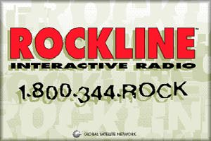
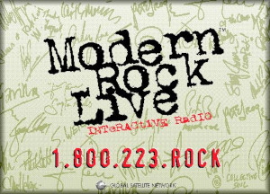
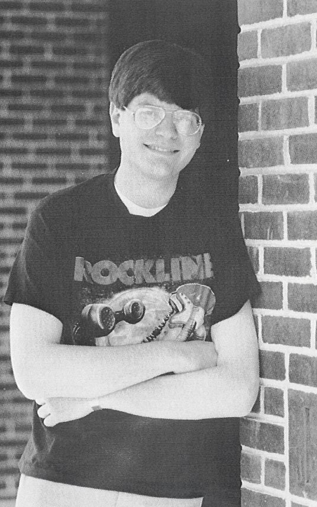
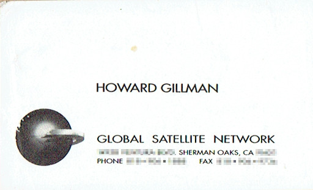
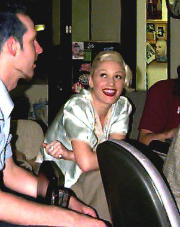
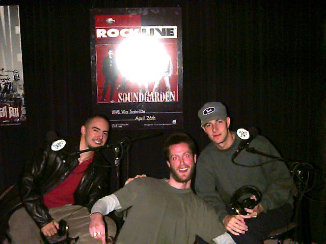
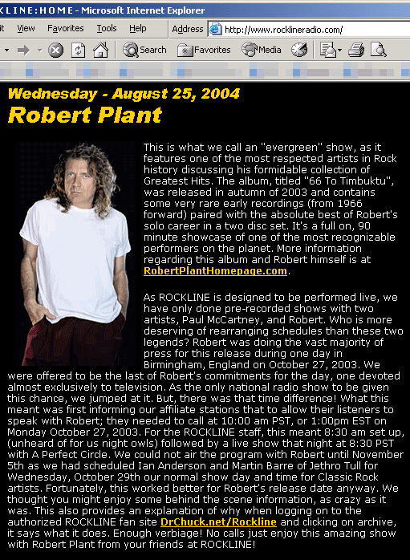

# A Little History

I am a microscopic footnote in the whole history of rock 'n' roll. So, how did
that happen? Well, it's thanks to the radio shows _Rockline_ and
_Modern Rock Live_. How did I get involved with them, and how is my history
intertwined with theirs? Before I get to that, a little radio history is in
order...

{width=40%}

**_Rockline_** was a live, call-in radio show, where the audience could talk to
rock artists over the telephone. It started in 1981, on Monday nights at 8:30pm
Pacific (11:30pm Eastern), and ran for over 33 years. The guest list read like
a book of "Who's Who in Rock 'n' Roll." There were legends like
**George Harrison**, **Pete Townshend**, and **Rush**. Also, there were metal
gods, like **Ozzy Osbourne**, **Judas Priest**, and **Metallica**. As the
1980s turned into the 1990s, newcomers were featured, like the
**Smashing Pumpkins**, **Soundgarden**, and **Foo Fighters**. In 1999, the show
split into two nights, Monday and Wednesday, with the Monday show featuring
mostly newer artists for "active rock" radio, and the Wednesday show with
"classic rock" artists.

The show originated from Los Angeles, and was heard locally on **95.5 KLOS**.
The first host was **B. Mitchel Reed**, and his first guest was **Joe Walsh**.
After six months, B. Mitchel Reed left the show (on March 16, 1983, he died due
to a lingering heart condition). **Bob Coburn**, also known as "B.C.", then
became the host, and his first guest was **Rod Stewart**. Bob Coburn held that
position until the early 1990s. Following his departure, there were three
other hosts over the next several years: **Steve Downes**, **Beau Rials**,
and **Riki Rachtman**. On March 10, 1997, Bob Coburn returned to hosting
duties, and eventually became the owner of the program in 2003. The show ceased
broadcasting in December 2014. Bob Coburn died on December 17, 2016, after a
long battle with lung cancer.

{width=40%}

**_Modern Rock Live_** was another live, call-in radio show. It featured
artists of the alternative/modern rock genre, and coincided with the rise of
the "alternative nation" in the 1990s. The show was created in 1991, hot on
the heels of the breakthrough of **Nirvana** (who were on the show in early
1992). There were guests who were alt-rock pioneers in the 1980s, like
**Depeche Mode**, **Kate Bush**, and **Morrissey**. Of course, there were also
many newer artists, including **Green Day**, **Weezer**, and
**Alanis Morissette**.

One of its first affiliates was **92.7 WDRE** in Garden City, New York. From
1982 to 1987, they were known as **WLIR**, one of the forerunners of
alternative and modern rock radio (and a station I gravitated towards to get
away from crappy Top 40 radio). In December 1987, they turned into WDRE, and
kept the music format in place.

Originally, _Modern Rock Live_ was a 60-minute show, broadcast live on Monday
nights at 11pm Eastern (8pm Pacific), hosted by **Tom Calderone** of WDRE. In
1994, it was purchased by Global Satellite Network, the parent company of
_Rockline_, and moved to Tuesday nights. In 1995, it expanded to a 90-minute
show on Sunday nights with a start time of 10:30pm Eastern (7:30pm Pacific).
After Tom Calderone started working for VH1 in 1998, **Max Tolkoff** took over
hosting duties, and would remain there until the show's final broadcast in
November 2000.

Got all that? Good.

## From the Beginning

It was 1985. **Dire Straits** was getting their money for nothing, and
**Aerosmith** was doing it with mirrors. **92.3 K-Rock** in New York City
became a new affiliate of _Rockline_, a live, weekly, call-in radio show that
let the audience interview rock musicians. I thought it was pretty cool. It was
**Mark Knopfler's** 36th birthday, and I was still in high school.

Unfortunately, since the show was live from Los Angeles, it was on late every
Monday night on the east coast. Plus, the local station didn't always do a good
job of promoting the artists who were coming up that week, and I couldn't stay
up late every week just to find out who was going to be on the show. Remember,
this was way before social media existed, and the Internet wasn't part of the
public conscious. You had radio, TV, newspapers, and magazines. That's it.

However, when I got to college, I was able to listen every week, partly because
staying up late was a requirement of being a college student, but mostly
because _Rockline_ was one of the few shows that featured current and classic
rock artists. During that time, I became quite attached to the show. I even
tried calling in when they had **Melissa Etheridge**, but I failed in the
attempt.

It was at this point that I met Tom Calderone. In 1989, I was visiting
**103.9 WRCN** in Riverhead, and he was on his way out to... um... drive the
prize van to a local mall. Yes, this is what he was doing, before he moved on
to **92.7 WDRE**, and became the host of _Modern Rock Live_. He certainly paid
his dues, didn't he?

{width=60%}

## The Times They Are A-Changin'

In 1990, I graduated from college and moved on to graduate school. It was there
I discovered the Internet, and learned how to use email and Usenet (basically,
network-wide discussion groups). The interface was command-line and text-only,
but I thought it was a great way to communicate, collaborate, and share
information (and to meet girls, but I digress). On Usenet, there were many
music-oriented discussion groups. People would talk about their favorite bands,
and post news and rumors. There were some groups that had to do with radio and
radio shows, but nobody was really posting about _Rockline_, unless a huge
name was going to be on that week. I still had to rely on the local affiliate
for that information (which was hit or miss, but a little more hit than miss).

A couple of years later, I was out of school, and found a mailing list where
people posted about upcoming live radio performances, such as concerts and
interviews. One guy was posting about upcoming guests on _Modern Rock Live_,
but nobody was posting about _Rockline_. Both shows often had live performances
in the studio. Since I was listening to _Rockline_ weekly anyway, I started
posting upcoming guest lists there. I also kept track of their affiliate list
as well, simply from listening to the show. Mailing list members would ask me
what station had the show, and I'd send the list. Sometimes I'd trade tapes of
shows. It was fun posting on Tuesday what was just announced the previous
night.

## Message in a Bottle

I kept posting to the mailing list for about a year. In the meantime, the World
Wide Web helped bring pictures and sound to the Internet, making it text-only
no longer. This helped the Internet become more appealing to the general
public. I had a rather clunky web browser called **SlipKnot** (no relation to
the band of the same name), but it got me around and helped me learn HTML. In
November 1994, I created a personal website with the free storage I had with
my Internet Service Provider. The _Unofficial Rockline website_ was born. It
featured the upcoming guest list and affiliate list, all without me having to
mail anything (but I still posted updates to the mailing list). The site only
had a few images, but the content was useful enough. Anybody in the world could
view it at any time.

A couple of months later, _Rockline_ and sister radio show _Modern Rock Live_,
created an area for themselves on America Online (AOL). It had pictures and
transcripts of AOL chats with the guests. The chats were held one hour prior to
that night's program. I didn't have AOL, but...

{height=400px}

Towards the end of 1995, I got an email. It was completely unexpected, and
nothing I could have anticipated. Howard Gillman, the producer of _Rockline_,
had been checking out my website, and thought that I might be interested in
helping maintain their area on AOL. I wasn't entirely sure what this would
entail, or even how AOL content worked (I was still learning things about
HTML), but it seemed like a cool idea, so I took it. I figured I could handle
it... and my day job... and maintain my website... not to mention keep posting
to the mailing list.

In January 1996, I had control over the AOL area of
_Rockline/Modern Rock Live_. They sent me chat transcripts and pictures to post
there.

{width=80%}

{width=80%}

## Dazed and Confused

Things were taking their toll on me. My responsibilities at work were getting
rather intense, and my attention was very divided, so it was quite difficult
to focus. My website was getting neglected, as well. To top it off, I was
getting tired of the AOL area, and that was only after a few months. Not only
was there content in the area that needed to be updated, but message boards
had to be monitored, and emails needed to be answered (a lot of them). If I
knew there was going to be this much to it, I might have reconsidered their
original offer. I got a phone call that summer from one of the guys at AOL
who noticed that things had kind of gone downhill (to put it mildly) in the
area. So, I told him that it was much more than I anticipated. They then went
about finding a new maintainer. This left me free to concentrate on my day
job, and give my website a bit more attention than it was getting.

I kept my unofficial _Rockline_ site going. I still liked the show, and the
site helped me learn more about HTML and other web-related technologies.
Occasionally, I'd get an email from an AOL user about something, and I'd ask
them why they didn't use the _Rockline_ area on AOL. Their reply? They liked
mine better. That gave me a little incentive to keep things going.

The AOL area closed sometime in 1997. That meant everyone, including the
lawyers, was looking at my site again. I improved its appearance, expanded it,
created a database of past guests, and added a message board where visitors
could trade tapes with each other. Trade being the keyword here, sales were
explicitly prohibited (lest someone might violate copyright laws, I was
actually quite concerned about that).

Oh, I wasn't kidding about the lawyers. When _Rockline_ was acquired by AMFM,
a then-subsidiary of Chancellor Media, I got this email from Howard Gillman,
who was still the producer:

> There has been quite a lot of conversation about you from Chancellor legal
and execs. I think I have successfully convinced them to leave you alone. Your
website is terrific. Much better than it used to be. Looks great. If you
experience any problems with them, let me know. Hope all is well with you.

## Ramble On

Music was changing. Actually, it had been changing ever since Nirvana released
"Smells Like Teen Spirit." The show expanded to two nights in January 1999.
Monday nights were for current artists, and Wednesday nights for classic rock
acts. This made things a little more difficult on me, as I had to keep up with
two shows per week instead of one. By this time, I recognized only about half
the guest names coming on the Monday show. I was still interested in new music,
but I had no idea who **Mushroomhead**, **Mudvayne**, and **Glassjaw** were.
At some point, I had no local station that carried the Monday show. However,
there were people on the Internet willing to pitch in for the nights that I
couldn't hear it. In the years 2000 and 2001, I even got a little help from
the new staff at _Rockline_. They had no official site yet, but they would pass
on guest lists and affiliate info to me, and I'd post it on the site.
The staff, including Bob Coburn, loved the site.

For years, I wondered when _Rockline_ would get around to putting up an
official site. In February 2002, I stopped wondering, as that was when their
own official website went online. For the first time, I didn't have to listen
to the show to find out who was coming up the following week, I could just...
go to their website. With this new turn of events, was my site still needed?
I had things they didn't have, like a message board and a list of frequently
asked questions (FAQ). I actually hadn't planned on running my website this
long, as it only started out as an HTML learning tool. Still, visitors
continued to come to the site, so I kept it going. In fact, the site morphed
from an _unofficial site_ to an _authorized fan site_.

With the official site in full swing, weekly listening was no longer required
just to find out who was coming up the following week. I was also able to skip
nights where I had already heard the show, or wasn't keenly interested in the
band. That's when I started to think... why am I keeping my site going?
I wasn't being as creative as I used to be with it, and I wasn't getting the
same enjoyment I used to, either. I felt like I was "phoning it in."
Copy/paste. I wanted to do something different, but I wasn't sure what that
was going to be.

## End of the Line

I started retiring various sections of my personal website in 2005, and got
around to retiring the _Rockline_ section that summer... over 10 years after I
started the site... nearly 20 years since I first heard _Rockline_. Rather than
let the content disappear, I sent the FAQ and database of past guests to the
staff at _Rockline_, in case they had a need for the data. My _Rockline_
listening diminished as the summer turned to fall and winter, but I'd visit
their site to check up on them, and see what was going on.

Years passed, and their site went through a few redesigns. They did get some
use out of the guest database I had given them. I could tell they used it as
a starting point "Archive History" section on their site. In those years, the
Internet became far more ubiquitous than it was in the early 1990s. Napster
came and went, and the Apple iPod was introduced. Both had an influence on the
way we listen to and purchase music. Social media sprang up. Twitter, Facebook,
and YouTube allowed celebrities to keep in touch with their fans, sometimes
interacting with them directly. _Modern Rock Live_ had already fallen by the
wayside in November 2000, due to money issues and budget cuts, but could
_Rockline_ survive in these new, super-connected, highly interactive times?

In November 2014, Bob Coburn released this statement:

> The world has changed from an innovative, unique idea back in 1981 to a one
of near constant exposure for artists in 2014. With the Internet, Twitter
accounts, hundreds of television channels and a more sophisticated press,
artists are now literally at the fingertips of their fans. ROCKLINE is no
longer the invaluable tool to connect fans with their Rock & Roll heroes,
it has become but one of many. We have had the honor to present the history
of Rock as told by the artists who created it for the past three decades-plus,
but now is the time to pass the mantle. We will proudly present the very best
of ROCKLINE until the end of the year when our mics will fall silent forever.
Thanks for listening and long live Rock & Roll!

_Rockline_ broadcast its last show in December 2014. Two years later, on
December 17, 2016, Bob Coburn died of lung cancer. **95.5 KLOS** remembered the
legacy of Bob Coburn and _Rockline_ by broadcasting replays and tributes. A
Facebook group named **Tribute to Bob Coburn**^[<<https://www.facebook.com/groups/TributeToBC>>]
was created, bringing together fans from all over the globe. In 2022, he was
posthumously inducted into the Radio Hall of Fame.^[<<https://www.radiohalloffame.com/bob-coburn>>]
For further articles and links with memories of Bob Coburn, see
[Remembering Bob Coburn].

It's been a "long, strange trip," but what a trip it was. My contributions
won't ever get mentioned in the rock 'n' roll history books, but I know what
I've done. Now, you do too.
